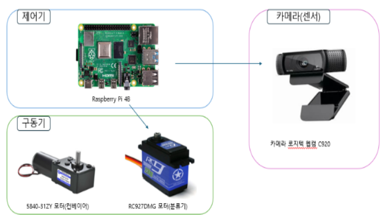
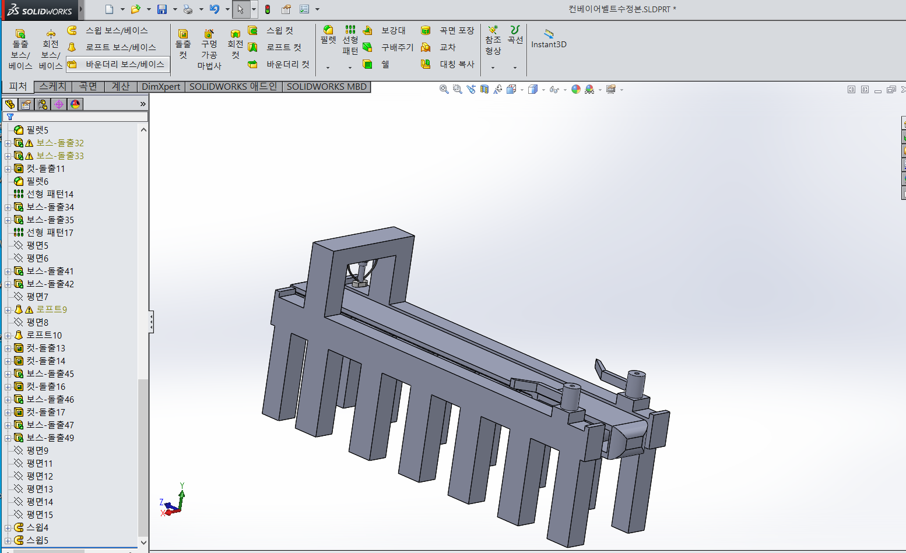
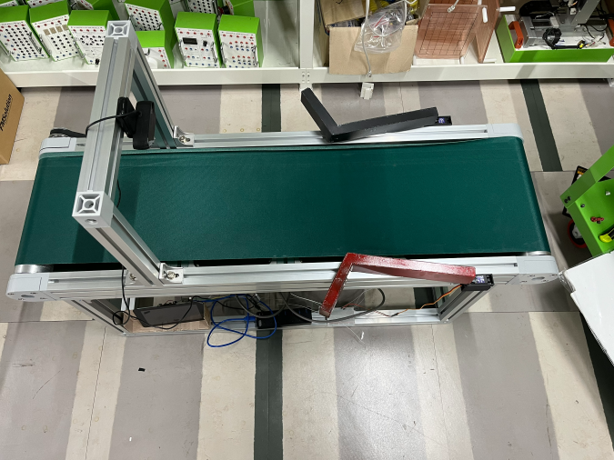
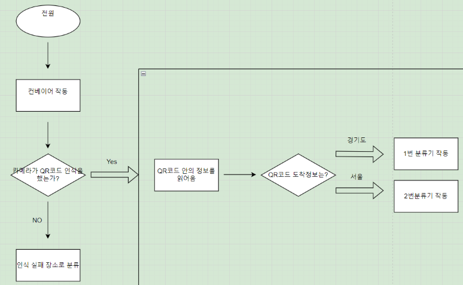

# 🚦 스마트 분류 컨베이어 (Smart_Sorting_Conveyor)

스마트 분류 컨베이어 프로젝트는 라즈베리파이4B 환경에서 로지텍웹캠 C920카메라를 활용하여 OpenCV 이미지처리를 활용하여  
컨베이어 벨트위에 택배상자를 올려놓으면 택배상자 위에 부착된 
QR코드 정보를 읽어와서 자동으로 지역별로 분류를 시행하는 프로젝트입니다.

---

## 📌 프로젝트 개요

- **수행 기간:** 2025.03.06 ~ 2025.03.21
- **사용 기술:**
  - Python
  - Raspberry Pi4B
  - 로지텍 웹캠 C920
  - RC927DMG 서보모터
  - 5840-31ZY DC모터
    
- **주요 기능:**
  
  - 웹캠으로 openCV활용하여 QR코드 정보 인식
  - QR코드 정보를 라즈베리파이에서 서보모터 제어
  - 분류기가 작동하여 지역벌로 분배
  

---

## 🛠 기술 스택

| 기술 | 설명 |
|------|------|
| Python | 전체 시스템 로직 및 이미지 처리 구현 |
| OpenCV | QR코드 이미지 처리를 통해 데이터 가져옴 |
| Raspberry Pi4B | 임베디드 환경에서 실시간 시스템 구동 |
| RC927DMG 서보모터 | 라즈베리파이 환경에서 제어 |
| 로지텍 웹캠 C920 | openCV를 활용하여 리더기 없이 QR코드 정보 읽어옴 |
| 5840-31ZY DC모터 | 컨베이어벨트 구동 |

---

## 📋 컨베이어 모델링

### SOLIDWORKS 2015 사용

---
## ⚙️ 전처리, 학습 사진

### 1. 실제 사람, 차량 학습 후 테스트
 

### 2. 모형 데이터 라벨링 및 학습완료

 
 

---

##  📷  실물 사진

---

## 🧠 플로우차트

---

## 📂 소스 코드

### [소스코드 바로가기(상세코드설명포함)](https://github.com/ksi076/smart_road_management_system/tree/main/src)

---

## 🎥 시연 영상

### [인도 무단횡단 감지 시연](https://drive.google.com/file/d/1JJZ4wy2REE9QvrCth4uMI0Oh-UzQre7v/view?usp=sharing)
]

### [차도 무단횡단 감지 시연](https://drive.google.com/file/d/10VPleeBBzlbaidgrZ4XxjRO3DYnDbJa4/view?usp=sharing)

### [불법 주정차 감지 시연](https://drive.google.com/file/d/1wICn6sA5SGs-cMUMmPEFmAYt1xEubBA2/view?usp=sharing)

### [불법 유턴 감지 시연](https://drive.google.com/file/d/1-yff9gF1twIYAe5XEUdBGuQiPEu5qhGJ/view?usp=sharing)

### [차량 횡단보도 침범](https://drive.google.com/file/d/1e-4tieU3bb9hKjmdHmfrGHj2JFM-pdN3/view?usp=sharing)

### [긴급상황 사고](https://drive.google.com/file/d/11_sgPJO63pYdR7drzoCO-xOwAlElfMGV/view?usp=sharing)

### [긴급 차 비켜주기](https://drive.google.com/file/d/1XEe5XvLOEKhPmtaGWWo1Pxdk5H6INKlp/view?usp=sharing)

---

##  💻  디스플레이 및 야간 LED 사진

  
  
  

### 1. 디스플레이 (XPT2046 Touch Controller)
- 라즈베리파이5와 연결하여 UI화면 제어

### 2. 야간 무단횡단 감지
- 보행자 빨간불 또는 신호상관 없이 횡단보도 외 도로 침범 시 네오픽셀 빨간LED 점등

### 3. 야간 차량침범 감지
- 보행자 초록불 신호에 차량이 횡단보도 침범 시 네오픽셀 파란LED 점등

---

## 💾  데이터베이스 사진

### 1. 데이터베이스 테이블

### 2. 데이터베이스 이미지

---

## ⚠️ 문제 해결 과정 (Trouble Shooting)

### 🚦 신호등을 사람으로 잘못 인식하는 문제

- **문제:** 빨간 사람 학습 후 신호등의 빨간 신호를 person클래스로 오탐  
- **해결:** 특정 ROI 영역 안의 person 감지를 continue하여 오탐 방지  

### 🚗  car클래스를 밤에 인식하지 못하는 문제

- **문제:** 낮과 밤을 묶어 vehicle 클래스를 학습시킨 결과 밤에 car를 인식하지 못함  
- **해결:** 낮과 밤을 클래스로 나눠 학습하여 해결 → vehicle, carnigh 클래스로 분류  

### 🚶  사람을 인식하지 못하는 문제

- **문제:** 카메라 2대를 사용하기 때문에 카메라 속도 유지를 위해 YOLO5n을 사용하자 인식하지 못함  
- **해결:** YOLO8s로 학습하여 인식못하는 문제를 해결하고 학습완료된 best.pt 파일을 best.onnx 파일로 교체하여 속도문제를 해결
---

## 📈 향후 개선 방향

- 보행자 세분화
  ex) 유모차, 휠체어, 보행 보조기
- 도로에서의 위험 요소 인식
  ex) 낙하물 및 장애물, 쓰레기, 타이머, 동물 등
- 자율주행 및 스마트차량
  ex) V2X(vehicle to Everything)통신 연동
