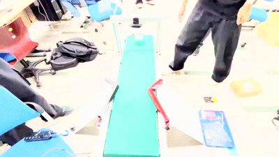
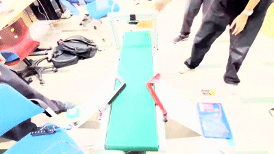

# ⚙️ 스마트 분류 컨베이어 (Smart_Sorting_Conveyor)

스마트 분류 컨베이어 프로젝트는 라즈베리파이4B 환경에서 로지텍웹캠 C920카메라를 활용하여 OpenCV 이미지처리를 활용하여  
컨베이어 벨트위에 택배상자를 올려놓으면 택배상자 위에 부착된 
QR코드 정보를 읽어와서 자동으로 지역별로 분류를 시행하는 프로젝트입니다.

---

## 📌 프로젝트 개요

- **수행 기간:** 2024.03 ~ 2024.06
- **사용 기술:**
  - Python
  - Raspberry Pi4B
  - 로지텍 웹캠 C920
  - RC927DMG 서보모터
  - 5840-31ZY DC모터
    
- **주요 기능:**
  
  - 웹캠으로 openCV활용하여 QR코드 정보 인식
  - QR코드 정보를 라즈베리파이에서 서보모터 제어
  - 분류기가 작동하여 지역벌로 분배
  

---

## 🛠 기술 스택

| 기술 | 설명 |
|------|------|
| Python | 전체 시스템 로직 및 이미지 처리 구현 |
| OpenCV | QR코드 이미지 처리를 통해 데이터 가져옴 |
| Raspberry Pi4B | 임베디드 환경에서 실시간 시스템 구동 |
| RC927DMG 서보모터 | 라즈베리파이 환경에서 제어 |
| 로지텍 웹캠 C920 | openCV를 활용하여 리더기 없이 QR코드 정보 읽어옴 |
| 5840-31ZY DC모터 | 컨베이어벨트 구동 |

---

## 🏗️ 컨베이어벨트 모델링

### SOLIDWORKS 2015 사용

---

##  📷  실물 사진

---

## 🔄 플로우차트

---

## 📂 소스 코드

### [소스코드 바로가기(상세코드설명포함)](https://github.com/ksi076/smart_sorting_conveyor/tree/main/src)

---

## 🎥 시연 영상

### [왼쪽 분류기 작동 시연]

### [오른쪽 분류기 작동 시연]

### [전체영상보러가기]([https://drive.google.com/file/d/1wICn6sA5SGs-cMUMmPEFmAYt1xEubBA2/view?usp=sharing](https://drive.google.com/file/d/1bjLSxtKFtGQgho1-OvszhMfFyIRKV1H1/view?usp=sharing])

